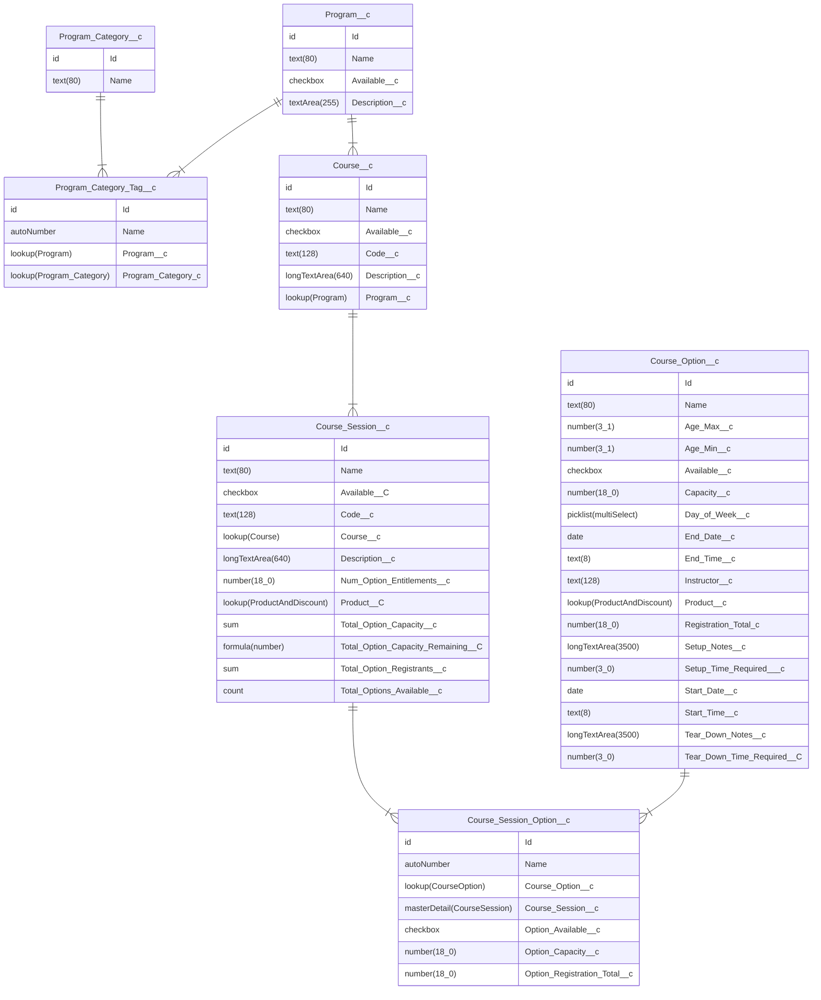

# YMCA Website Services Traction Rec integration

This module provides YMCA Website Services integration with the [Traction Rec CRM](https://www.tractionrec.com).

- JWT OAuth flow is used for the integration: [OAuth 2.0 JWT Bearer Flow for Server-to-Server Integration](https://help.salesforce.com/articleView?id=remoteaccess_oauth_jwt_flow.htm&type=5)
- The [Drupal Key module](https://www.drupal.org/project/key) assists with key management for authentication.

## Installation

Require this module:
```shell
composer require ycloudyusa/openy_traction_rec
```

Then enable the necessary modules and submodules:
```shell
drush en openy_traction_rec openy_traction_rec_import openy_tr_activity_finder
```

## Usage

The main module itself provides only API that helps fetch data from TractionRec. More specific functionality is provided in submodules:

* `YMCA Website Services Traction Rec: PEF import` provides PEF migrations.
* `YMCA Website Services Traction Rec: Activity Finder` extends YMCA Website Services Activity Finder with the new fields and logic.

## Configuration

### Create a Connected App

1. Create a new private key and X509 certificate, customizing the `subj` options in the command to suit your organization. (See [the manual for openssl-req](https://www.openssl.org/docs/manmaster/man1/openssl-req.html) to understand the options here.)
  ```shell
  openssl req -x509 -noenc -sha256 -days 365 -keyout traction_rec.key -out traction_rec.crt -subj "/C=US/ST=Illinois/L=Chicago/O=My YMCA/OU=Org/emailAddress=youremail@example.com"
  ```
2. In **Salesforce** > **Setup** > **App Manager**, create a **New Connected App**.
  - Check **Enable OAuth Settings**
  - Set the callback url as the base URL of your site
  - Check **Use digital signatures** and upload the X509 certificate (`.crt`) created above.
  - Ensure the app has the following **Selected OAuth Scopes**
    - Full access (full)
    - Manage user data via APIs (api)
    - Manage user data via Web browsers (web)
    - Perform requests at any time (refresh_token, offline_access)
  - Choose other configuration options as directed.
  - Save the Connected App
3. Once the app is saved, you will need to get the **Consumer Details**:
  - In the "My Connected App" screen that appears once you save (or via **App Manager**), click **Manage Consumer Details**.
  - Save the **Consumer Key** and **Consumer Secret** for the next step.
4. Give your app the correct profiles and/or permission sets in **Setup** > **Connected Apps** > **Manage Connected Apps**.

### Configure the connection in Drupal

* Go to **Admin** > **Configuration** > **System** > **Keys** (`/admin/config/system/keys`) and create a new key to store the private key created above.
  * **Add key**
  * Add a **Key name** and **Description**
  * Choose **Key Type**: "TractionRec JWT Private Key"
  * Choose the **Key provider** depending on your configuration. See [Managing Keys](https://www.drupal.org/project/key#:~:text=the%20encrypt%20module-,Managing%20keys,-Key%20provides%20an) for details.
  * Configure the chosen provider then **Save** the key.
* Go to **Admin** > **YMCA Website Services** > **Integrations** > **Traction Rec** > **Traction Rec auth settings** (`/admin/openy/integrations/traction-rec/auth`) to configure the keys & secrets provided by Traction Rec.
  * Add the **Consumer key** and **Consumer Secret** from **Manage Consumer Details** in Salesforce.
  * Add the **User** registered in the Connected App.
  * Enter a **Login URL**.
  * Set the **Services base URL** and **REST API Base URL** as per their descriptions.
    * **Ensure the REST API Base URL responds to `curl -I` with a `200` response**. If you use a URL like `*.lightning.force.com` instead of `*.my.salesforce.com` it may result in a redirect, which will cause fetches to fail.
  * Set the **Community URL** based on the publicly accessible registration links
  * Choose the key as configured above.

## Usage

See [modules/openy_traction_rec_import/README.md](modules/openy_traction_rec_import/README.md)

## Data Model

This module assumes a Traction Rec "standard" data model in its queries. Any deviations from this model will require overriding the queries in `src/TractionRec.php`.

This model contains a subset of the fields in Traction Rec that are relevant to our usage. All entities have more fields than listed.

Field types are taken from Salesforce's **Setup** > **Object Manager** > **{Entity}** > **Fields & Relationships**.

- Number field options are: `number(length_decimal places)`


