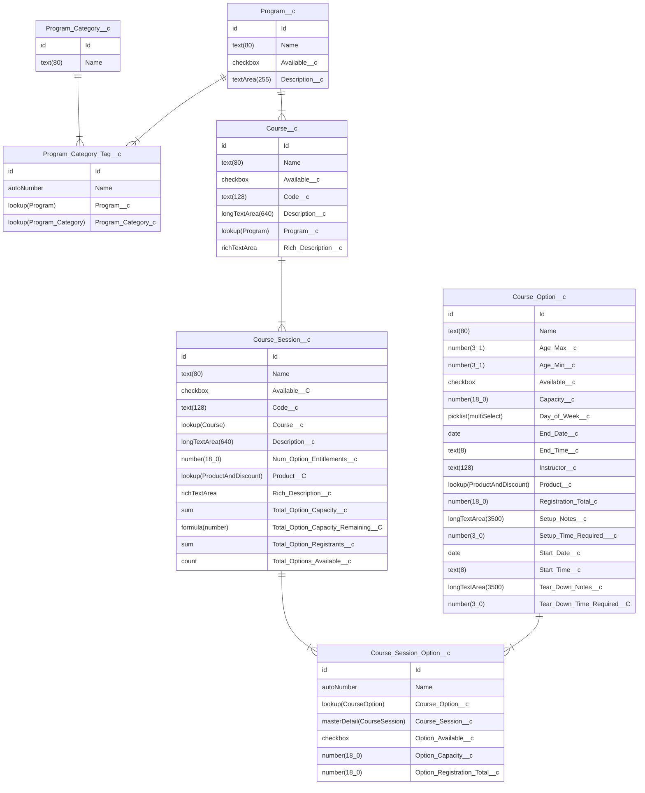

# YMCA Website Services Traction Rec integration

This module provides YMCA Website Services integration with the [Traction Rec CRM](https://www.tractionrec.com).

- JWT OAuth flow is used for the integration: [OAuth 2.0 JWT Bearer Flow for Server-to-Server Integration](https://help.salesforce.com/articleView?id=remoteaccess_oauth_jwt_flow.htm&type=5)
- The [Drupal Key module](https://www.drupal.org/project/key) assists with key management for authentication.

## Installation

Require this module:
```shell
composer require ycloudyusa/openy_traction_rec
```

Then enable the necessary modules and submodules:
```shell
drush en openy_traction_rec openy_traction_rec_import openy_tr_activity_finder
```

## Usage

The main module itself provides only API that helps fetch data from TractionRec. More specific functionality is provided in submodules:

* `YMCA Website Services Traction Rec: PEF import` provides PEF migrations.
* `YMCA Website Services Traction Rec: Activity Finder` extends YMCA Website Services Activity Finder with the new fields and logic.

See [modules/openy_traction_rec_import/README.md](modules/openy_traction_rec_import/README.md) for details on how to import content once configuration is complete.

## Configuration

### Create a Connected App in Salesforce

1. Create a new private key and X509 certificate, customizing the `subj` options in the command to suit your organization. (See [the manual for openssl-req](https://www.openssl.org/docs/manmaster/man1/openssl-req.html) to understand the options here.)
    ```shell
    openssl req -x509 -noenc -sha256 -days 365 \
     -keyout traction_rec.key \
     -out traction_rec.crt \
     -subj "/C=US/ST=Illinois/L=Chicago/O=My YMCA/OU=Org/emailAddress=youremail@example.com"
    ```
   - The email address in the certificate does not need to match the email on the Connected App.
   - The certificate **must be renewed yearly** (or after the set number of `--days`). We recommend you set a reminder in order to prevent unwanted failures.
2. In **Salesforce** > **Setup** > **App Manager**, create a **New Connected App**.
   - Set a **Name** and **Email**.
     - The **Contact Email** is not used for authentication.
   - Check **Enable OAuth Settings**
     - Set the callback url as the base URL of your site
     - Check **Use digital signatures** and upload the X509 certificate (`.crt`) created above.
     - Ensure the app has the following **Selected OAuth Scopes**
       - Full access (full)
       - Manage user data via APIs (api)
       - Manage user data via Web browsers (web)
       - Perform requests at any time (refresh_token, offline_access)
     - Check these options:
       - **Require Proof Key for Code Exchange (PKCE) Extension for Supported Authorization Flows**
       - **Issue JSON Web Token (JWT)-based access tokens for named users**
     - Uncheck all other options in the **OAuth** section.
   - **Save** the Connected App
3. Once the app is saved, you will need to get the **Consumer Details**:
   - In the "My Connected App" screen that appears once you save (or via **Setup** > **App Manager**), click **Manage Consumer Details**.
   - Save the **Consumer Key** and **Consumer Secret** for the next step.
4. Create a **Profile** OR **Permission Set** to assign permissions to your app. We recommend using a **Permission Set** as those are the option recommended by Salesforce.
   1. Your Traction Rec support team should be able to deploy the `Traction Rec Activity Finder Permission Set` from their `dev1` instance. If this Permission Set is deployed, proceed straight to the **User** creation step. To create a **Permission Set** from scratch:
     - **Setup** > **Users** > **Permission Sets** > **New**
     - Fill in the **Label** as you wish, and leave **License** as `--None--`
     - In the new **Permission Set**, open **Object Settings**.
     - In the very long list of **Object Settings**, do the following for each of the 10 [Objects listed below](#salesforce-permissions):
       - Find the object and click to open it. In the configuration screen for each Object:
         - Under **Object Permissions**, mark **Read** as **Enabled**.
         - Under **Field Permissions**, mark **Read Access** on the header field to provide access to all fields.
       - Save the **Object Settings** and search for the next one.
     - Finally, review the summary of access permissions and ensure **Read** access is provided for each of the necessary objects.
   2. Create a **Profile**:
      - You **must** do this **before** creating a user.
      - **Setup** > **Users** > **Profiles** > **New**
      - When asked what **Existing Profile** to clone from, select **Standard User** or **Standard Platform User**. Be sure to note the **User License** connected to the target profile.
      - In the _very large_ configuration screen, click **Edit**, then:
        - Under **Connected App Access**, add access to the Connected App you created above.
        - Search for and enable the [System permissions listed below](#salesforce-permissions).
        - Under **Custom Object Permissions**, add **Read** access to the [Objects listed below](#salesforce-permissions).
      - Save those changes.
4. Create a new **User** with the new Profile or Permission Set:
  - **Setup** > **Users** > **New User**
    - **User License** - The option under which you created the Profile in the previous step, or **Salesforce**.
    - **Email** - A working email that you will use to receive login verifications.
    - **Username** - This is _not_ your email and _must_ be unique across _all Salesforce Organizations_. **This is the name that will be used in the Drupal connection below.** If you enter a preexisting username, you will receive this error:
      > Error: Duplicate Username.
      > The username already exists in this or another Salesforce organization. Usernames must be unique across all Salesforce organizations. To resolve, use a different username (it doesn't need to match the user's email address).
    - Assign the User to the **Profile** you created above, or a **Permission Set** that has the [necessary permissions](#salesforce-permissions).
      - Under **Permission Set Assignments**, click **Edit Assignments**
      - Find the **Permission Set** you created in the prior step, select it, click **Add**, then **Save**.
5. Confirm your **Connected App**, **Profile**, and **User** are connected:
   - Go to **Setup** > **Apps** > **Connected Apps** > **Manage Connected Apps** and choose your new app. Assign the **Profile** or **Permission Set** that contains your new user if it does not already show under the relevant section.
     - Click **Manage Profiles** or **Manage Permission Sets**
     - Search for your Profile or Permission Set and Save.
   - In the Connect App Detail, click **Edit Policies**:
     - Under **OAuth Policies** > **Permitted Users** choose **Admin approved users are pre-authorized**.
     - Check **Issue JSON Web Token (JWT)-based access tokens**.
     - **Save** the Connected App details.

> When the process is complete, you should have the following relationships between the **User**, **Permission Set** OR **Profile**, and **Connected App**:
> - the API **User** should be assigned the **Permission Set** OR **Profile**.
> - the **Connected App** should be assigned the same **Permission Set** OR **Profile**.

Review all of these steps carefully. Missing any of them can result in an inability to query the API.

#### Salesforce permissions

The Salesforce integration **Permission Set** OR **Profile** should have read access to all fields in the following objects:

* Course Options
* Courses
* Course Session Options
* Course Sessions
* Locations
* Products and Discounts
* Program Categories
* Program Category Tags
* Programs
* Sessions

If using a **Profile**, it should also have the following Systems Permissions:

* Apex REST Services
* View Restriction and Scoping Rules
* Update Consent Preferences Using REST API

### Configure the connection in Drupal

1. Go to **Admin** > **Configuration** > **System** > **Keys** (`/admin/config/system/keys`) and create a new key to store the private key created above.
   - **Add key**
   - Add a **Key name** and **Description**
   - Choose **Key Type**: "TractionRec JWT Private Key"
   - Choose the **Key provider** depending on your configuration. See [Managing Keys](https://www.drupal.org/project/key#:~:text=the%20encrypt%20module-,Managing%20keys,-Key%20provides%20an) for details.
   - Configure the chosen provider then **Save** the key.
2. Go to **Admin** > **YMCA Website Services** > **Integrations** > **Traction Rec** > **Traction Rec auth settings** (`/admin/openy/integrations/traction-rec/auth`) to configure the keys & secrets provided by Traction Rec.
   - Add the **Consumer key** and **Consumer Secret** from **Manage Consumer Details** in Salesforce.
   - Add the **User** connected to the Connected App.
     - This is the **Username** of the **User**, not the **Contact email**.
   - Enter a **Login URL**.
     - This will most likely be `https://login.salesforce.com`
   - Set the **Services base URL** and **REST API Base URL** as per their descriptions.
     - **Ensure the REST API Base URL responds to `curl -I` with a `200` response**. Replace URLs like `*.lightning.force.com` with `*.my.salesforce.com` because the `lightning` url may result in a redirect, which will cause an authentication error, like (`[@"message":"Session expired or invalid","errorCode":"INVALID_SESSION_ID"]`).
   - Set the **Community URL** based on the publicly accessible registration links.
     - This may be something like `https://my-ymca.my.site.com`
     - The URL can be found in Salesforce under **Setup** > **Digital Experiences** > **All Sites**.
   - Choose the key as configured above.

## Mapping

The TractionRec importer pulls data from [many Traction Rec Objects](#salesforce-permissions) (see [TractionRec.php for the full queries](https://github.com/YCloudYUSA/openy_traction_rec/blob/main/src/TractionRec.php)):

### Object Mapping

The fetcher outputs these files:

- `classes.json` - from Courses
  - Maps to both Activities and Classes. Since TREC does not have this distinction, information in the resulting Activities and Classes in Drupal is duplicated.
- `locations.json` - from Locations
  - This file is unused, but Locations map to Location via the Session import.
- `program_categories.json` - from Program Category Tags
  - Maps to Program.
- `programs.json` - from Programs
  - Maps to Program Subcategory.
- `sessions.json` - from Course Options
  - Maps to Session.

**Note:** Traction Rec's labels for "Programs" and their child groupings are different:

- Traction Rec: "Program Category" is the parent of "Program".
- Drupal: "Program" is the parent of "Program Subcategory".

### Mapping to Drupal fields

Those files are then imported into Drupal content via [importers](https://github.com/YCloudYUSA/openy_traction_rec/tree/main/modules/openy_traction_rec_import/config/install) (in config items that start with `migrate_plus.`). The import goes as follows:

> - Drupal Content Type (bundle)
>    - `Salesforce/TractionRec source field` → `Drupal destination field`

- **Program** - from `programs.json` / TREC Program Categories
  - Id → id
  - Name → Title
  - Available → Published (`status`)
- **Program Subcategory** - from `program_categories.json`/ TREC Programs
  - Id → id
  - Name → Title
  - Program → Program (`field_category_program`) via a lookup to the Programs import
  - Available → Published (`status`)
- **Activity** - from `classes.json` / TREC Courses
  - Id → id
  - Name → Title
  - Program/Id → Program Subcategory (`field_activity_category`) via a lookup to the Program Subcategory import
  - Available → Published (`status`)
- **Class** - from `classes.json` / TREC Courses
  - Id → id
    - The Class Id will also be used to set the Activity (`field_class_activity`)
  - Name → Title
  - Program/Id → _ignored_
  - Description/Rich Description → Description (`field_class_description`)
    - If a Rich Description is set, it will be used, otherwise the Description field will be used.
  - Available → Published (`status`)
- **Session** - from `sessions.json` / TREC Sessions
  - Course_Option/Name → Title
  - Course_Option/ID → id
    - Also used to generate the Registration link URL using the Community URL set in Traction Rec auth settings (`/admin/openy/integrations/traction-rec/auth`).
  - Course_Session/Course/Id → Class
  - Course_Session/Course/Name → Course
  - Course_Session/Course/Description & Rich_Description → Description (`field_class_description`)
      - If a Rich Description is set, it will be used, otherwise the Description field will be used.
  - Course_Option/Start_Date → Session Time > Start date
  - Course_Option/Start_Time → Session Time > Start time
  - Course_Option/End_Date → Session Time > End date
  - Course_Option/End_Time → Session Time > End time
  - Course_Option/Day_of_Week → Session Time > Days
  - Course_Option/Age_Min → Min Age (`field_session_min_age`) converted to months
  - Course_Option/Age_Max → Max Age (`field_session_max_age`) converted to months
  - Course_Option/Location/Name → Location (`field_session_location`)
    - Location Name is used as a backup in case the Location Mapping does not match.
  - Course_Option/Location/Id → Location (`field_session_location`)
    - Location ID is used to attempt to match a location in the Location mapping in the Traction Rec importer settings (`/admin/openy/integrations/traction-rec/importer`)
  - Course_Option/Instructor → Instructor (`field_session_instructor`) trimmed to 255 characters
  - Course_Option/Available_Online → Online registration (`field_session_online`)
  - Course_Option/Available → Published (`status`)
  - Course_Option/Register_Online_From_Date → not used
  - Course_Option/Register_Online_To_Date → not used
  - Course_Option/Capacity → Initial Availability (`field_availability`)
  - Course_Option/Total_Capacity_Available → Initial Availability (`field_availability`)
  - Course_Option/Unlimited_Capacity → if set, overrides Capacity and sets Initial Availability (`field_availability`) to 100
  - Course_Option/Unlimited_Waitlist_Capacity → Wait list Unlimited Capacity (`waitlist_unlimited_capacity`)
  - Course_Option/Waitlist_Total → Wait list capacity (`waitlist_capacity`)
  - Course_Option/Product/Price_Description → Price description (`field_price_description`)
  - Course_Session/Id → Class (`field_session_class`) via a lookup to the Class import

## Data Model

This module assumes a Traction Rec "standard" data model in its queries. Any deviations from this model will require overriding the queries in `src/TractionRec.php`.

This model contains a subset of the fields in Traction Rec that are relevant to our usage. All entities have more fields than listed.

Field types are taken from Salesforce's **Setup** > **Object Manager** > **{Entity}** > **Fields & Relationships**.

- Number field options are: `number(length_decimal places)`


